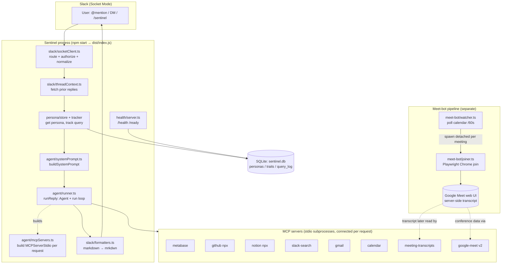

# Sentinel Architecture

## Overview

Sentinel is a leadership/data assistant for Newton School, delivered as a Slack bot powered by an in-process **OpenAI Agents SDK** agent loop (`@openai/agents`, in `src/agent/`). It started as a narrow POC wired to three data sources (Metabase, GitHub, Notion), but the live codebase has grown well beyond that: the agent runs a GPT-5-class model in a tool-calling loop and, per request, connects up to **eight MCP servers** (acting as the MCP client) — Metabase, GitHub (npx package), Notion (npx package), plus custom Slack-search, Gmail, Google Calendar, Drive/Docs transcripts, and Google Meet API v2 servers. On top of the Q&A bot, Sentinel runs an entirely separate **Playwright-driven Google Meet pipeline**: a calendar watcher polls the Sentinel Google account every 60s and auto-launches a headless Chrome bot that joins meetings and turns on Google's server-side transcription, so that meeting transcripts later become queryable. State (per-user personas, learned traits, and an audit log of every query) lives in a local SQLite database, and the process exposes `/health` and `/ready` HTTP endpoints for container orchestration.

## High-Level Component Diagram

The Q&A path (Slack → runner → OpenAI Agents SDK loop → MCP servers) and the Meet-bot path (calendar watcher → joiner → Google's server-side transcript) are independent pipelines that happen to share the same process and the same Google OAuth credentials. They connect only loosely: the Meet bot ensures transcripts get *generated*, and the `meeting-transcripts` / `google-meet` MCP servers later let the agent *read* them.

Not shown in the diagram (added after it was drawn): the **memory subsystem** (PRs #57–#60) — `searchMemories` feeds recalled facts into `buildSystemPrompt`, a post-response hook and a 5-min ingest poller write new facts into the `memories` tables, and a ninth MCP server (`memory`, in `src/mcp/memory.ts`) gives the agent explicit `memory_*` tools. See the `memory` subsystem entry below.

## Runtime Entrypoints

Sentinel has two distinct ways to run:

1. **Main bot** — `npm start` (runs `node dist/index.js`; dev: `npm run dev` via tsx). `main()` in `src/index.ts` bootstraps in order: open SQLite (`getDb`), init the agent harness (`initAgentHarness` — sets the OpenAI key + disables SDK tracing), start the health server (`startHealthServer`), start the Meet watcher (`startMeetWatcher`), then create and start the Slack Socket Mode app. Every inbound message flows through `handleEvent`.
2. **Meet-bot scripts** — invoked separately from the main process:
   - `npm run meet-bot:setup` (`tsx src/meet-bot/setup.ts`) — one-time interactive headed Chromium launch so a human signs in as `sentinel@newtonschool.co`; the persistent profile (`data/sentinel-chrome-profile`) is reused by every later join.
   - `npm run meet-bot:join` (`tsx src/meet-bot/joiner.ts`) — the per-meeting joiner CLI (accepts a Meet URL, `--duration`, `--headed`, `--stay-mode`). Normally spawned automatically by the watcher, but can be run by hand.

## Subsystems

### entry-config — `src/index.ts`, `src/config.ts`, `src/logging/logger.ts`, `src/types/contracts.ts`
**Purpose:** Process bootstrap, env/config validation, structured logging, and shared type contracts. `config.ts` exposes a side-effect-free `loadConfig()` that parses `process.env` with Zod and calls `process.exit(1)` on invalid config; the schema now `.refine`s that `ALLOWED_USER_IDS` is non-empty and that the three Google OAuth vars are all-set-or-all-unset (#26). `logger.ts` is a Pino root logger with component child loggers. `index.ts` wires the whole pipeline and registers SIGINT/SIGTERM handlers that run a `createGracefulShutdown()` sequence (#28). `handleEvent` enforces a 3-request in-flight concurrency cap and drives the eyes→check/x reaction state machine.
**State:** Solid. The config loader is now tested directly (incl. the exit path, #32) instead of through a re-declared copy. Startup-validation gaps are closed: an empty `ALLOWED_USER_IDS` and a partial Google credential set now fail validation loudly at boot (#26). Graceful shutdown drains in-flight requests (≤25s) and stops the watcher/Slack app/health server/DB (#28); already-detached Meet joiners are intentionally left running.

### slack — `src/slack/socketClient.ts`, `src/slack/threadContext.ts`, `src/slack/formatters.ts`
**Purpose:** Inbound/outbound Slack transport over `@slack/bolt` Socket Mode. `socketClient.ts` routes three event types (`app_mention`, DM messages, `/sentinel` slash command), authorizes against `ALLOWED_USER_IDS`, strips the bot mention, and normalizes everything into a `SlackEventEnvelope` for a single injected `EventHandler`. It de-duplicates Slack event retries with a per-app TTL deduper keyed `channel:messageTs` (#45). `threadContext.ts` fetches prior thread replies, now following the cursor via the shared `paginate()` helper instead of hard-truncating at 50 (#49). `formatters.ts` converts the model's Markdown to Slack mrkdwn while protecting code blocks.
**State:** Solid. `socketClient.ts` (event routing, the `isAllowed` authorization gate, mention stripping, DM-subtype filtering, slash ACK/post) and `threadContext.ts` now have handler-level tests via a faked Bolt App (#34). Event-retry de-duplication is in place (#45, in-process — adequate for the single-replica deployment). Remaining minor gap: mentions/DMs still get no immediate ack (only the slash command posts "Processing"); thread-context errors are still swallowed to `[]`.

### agent-runner — `src/agent/runner.ts`, `src/agent/systemPrompt.ts`, `src/agent/mcpServers.ts`, `src/agent/injectionBudget.ts`
**Purpose:** The in-process agent reply loop on the **OpenAI Agents SDK** (`@openai/agents`). `runner.ts` (`runReply`) builds an `Agent` (model = `OPENAI_REPLY_MODEL`, a GPT-5-class model) over per-request `MCPServerStdio` instances, runs the tool-calling loop via a `Runner`, and returns a `ReplyResponse` (`{ text, durationMs, tokens, costUsd, numTurns }`). Cost guards: a `maxTurns` cap (`AGENT_MAX_TURNS`) and an optional cumulative-token budget (`AGENT_TOKEN_BUDGET`) enforced by an `agent_tool_start` hook that aborts the run; an `AbortController` enforces the per-reply timeout (`timeoutMs <= 0` = unlimited, used by the analytics route). `systemPrompt.ts` builds the static "Sentinel" base prompt and appends IST time context, unavailable-source warnings, the user's persona, and learned traits — read-time decayed and capped to the top 8 by decayed confidence (#48). `mcpServers.ts` (`resolveServerSpecs`/`buildMcpServers`) ports the credential-gating + allowlist logic and constructs the stdio MCP servers per request — including a **fresh memory server per request** carrying the asker's ACL scope in its env (the isolation seam), connected before the run and closed in `finally`.
**State:** Solid; tested via mocked `@openai/agents` (agent config, `maxTurns`/abort, token-budget abort, telemetry mapping, per-request MCP connect/close, the viewer-scope security regression). The agent auto-approves MCP tool calls, so runner-level read-only is a soft prompt instruction (the hard read-only guard lives in the Metabase server, see mcp-data); custom MCP servers run from `dist/mcp/*.js`, so `npm run build` is required before they work under `npm start`.

### mcp-data — `src/mcp/metabase.ts`, `src/mcp/slack.ts`, `src/mcp/gmail.ts`
**Purpose:** Custom stdio MCP servers giving the bot read access to backing data. **Metabase** (session auth, via the side-effect-free `metabaseClient.ts`) exposes `metabase_query` (native SQL), `metabase_get_question`, `metabase_list_dashboards`, `metabase_list_databases`. **Slack** (xoxp user token) exposes `slack_search_messages`, `slack_read_channel_history`, `slack_read_thread`. **Gmail** (OAuth2) exposes `gmail_search`, `gmail_read_thread`, `gmail_list_recent`. Each server validates its required env at startup and exits naming any missing vars (#51).
**State:** Solid. Each server now has handler-level tests via an extracted pure `*Shape`/`*Lib`/`*Client` helper (#36), and the major correctness/security gaps are closed: `metabase_query` is now read-only-enforced by an AST check (`node-sql-parser`) that tolerates string-literal/parenthesized/UNION reads and falls back to the regex guard's verdict so it never regresses (#21→#43); the 401 re-auth path checks `retry.ok` and throws on failure (#24); Gmail body extraction recurses nested multipart parts (#29, HTML-only messages still return empty — no HTML fallback yet); read tools have request timeouts + 429/5xx retry-backoff (`fetchWithRetry`, #50) and bounded `paginate()` cursor handling (#49, `slack_search` left cap-only by design); thrown errors carry redacted status+statusText only, not raw upstream bodies (#42).

### mcp-google — `src/mcp/calendar.ts`, `src/mcp/meet.ts`, `src/mcp/transcripts.ts`
**Purpose:** Stdio MCP servers for Google Workspace, all sharing one Sentinel-account OAuth2 refresh token. **calendar** (googleapis v3) — `calendar_list_events` (default Mon–Fri week), `calendar_get_event`, `calendar_search`. **google-meet** (raw fetch against Meet REST API v2) — `meet_list_conferences`, `meet_get_conference`, `meet_list_transcripts`, `meet_get_transcript_entries`, with an in-process token cache. **meeting-transcripts** (Drive v3 + Docs v1) — `transcript_search`, `transcript_read`, `transcript_list_recent`. Each validates its required env at startup (#51).
**State:** Solid. Each server now has handler-level tests via an extracted pure helper (`calendarWeek`, `meetShape`, `transcriptsQuery`, #36). The earlier correctness/robustness gaps are fixed: calendar "this week" math is timezone-aware (`Intl`-based, two-pass DST-correct, fetches the primary calendar's `timeZone` with an `Asia/Kolkata` fallback) rather than local-server-time-based (#37); Meet transcript speakers are resolved to human names via the participants endpoint with an in-process cache, retaining the raw id (#31); read tools have bounded pagination/cursor handling (#49) plus timeouts + retry-backoff (#50); Drive `q` query values are escaped per the Drive q-grammar (#40). The product-shape constraint remains by design: `transcripts.ts` returns nothing unless a Doc is shared with Sentinel, and `meet.ts` returns nothing unless Sentinel actually joined the call live — which is exactly what the Meet bot exists to enable (see `docs/MEET_TRANSCRIPT_EXPERIMENT.md`).

### persona-state — `src/state/db.ts`, `src/persona/store.ts`, `src/persona/tracker.ts`, `src/persona/types.ts`
**Purpose:** SQLite-backed per-user personalization. `db.ts` is a lazy `better-sqlite3` singleton (WAL + foreign keys) with idempotent migrations for `personas`, `persona_traits`, `query_log` (the latter has `response_text`, `response_duration_ms`, `sources_used` columns added via guarded ALTERs) and `joined_meetings`; on init it creates `idx_query_log_user_id`/`idx_query_log_created_at` and runs `pruneQueryLog(90d)` once (#44). `store.ts` does race-safe get-or-create persona and `upsertTrait` via `INSERT … ON CONFLICT` (#30), maps snake_case rows to the camelCase types through a dedicated mapping layer (#20), and exposes `getTraitsForPrompt` which applies read-time decay. `tracker.ts` keyword-categorizes each query into one of seven `QueryCategory` buckets, logs it, and reinforces a `focus_area` trait.
**State:** Solid. The personalization-breaking camelCase bug is fixed by an explicit `mapPersonaRow`/`mapTraitRow` layer, so `persona.displayName` / `trait.evidenceCount` now resolve correctly (#20). Get-or-create and trait upsert are race-safe via `ON CONFLICT` (#30). Traits now decay at read time (30-day half-life, no row mutation) and the prompt caps to the top 8 by decayed confidence (#48). `query_log` has retention + indexes (#44). The store has real CRUD + confidence-math tests against an in-memory DB (#30) plus decay tests, replacing the previous mock-only coverage. (`sources_used` is still written but not read back — left as-is, out of scope.)

### memory — `src/memory/*` (`memorySql`, `rank`, `memoryStore`, `types`, `extractor`, `conversationHook`, `transcriptChunk`, `meetIngest`, `gmailIngest`, `ingestWatcher`), `src/llm/openaiClient.ts`, `src/mcp/memory.ts`
**Purpose:** Persistent organizational memory ("company brain"). Four flows:
1. **Recall → inject** — `handleEvent` calls `memoryStore.searchMemories(query)` (FTS5 `MATCH` ranked by bm25 + recency + confidence via `rank.ts`, with an automatic `LIKE`-scan fallback when FTS5 is unavailable or the table is broken) and `systemPrompt.ts` injects the top-k as *records, not instructions* under a hardened header. Recall is failure-proof by contract: any error returns `[]` and never fails the Slack reply.
2. **Hook → extract** — after each reply, the fire-and-forget `conversationHook` runs the user's message (user-turn-grounded; the bot's reply is fenced disambiguation context only) through `extractor.ts`: a hardened OpenAI `gpt-4o-mini` structured-outputs call (`openaiClient.ts` — dependency-free fetch, 500-call/day budget) followed by Zod re-validation, a mechanical verbatim evidence-quote check against the source content, and a secret-regex post-filter.
3. **Poller → ingest** — `ingestWatcher` ticks every 5 min and runs `meetIngest` (Meet transcripts of attended meetings, chunked + per-conference summary fact) and `gmailIngest` (recent email, **internal-sender-only allowlist** — `newtonschool.co` + `MEMORY_GMAIL_DOMAINS`; bulk/no-reply/self/short mail skipped). Restart-safe via `ingest_cursors` + `ingested_docs` dedup; per-source kill switches `MEMORY_INGEST_MEET=0` / `MEMORY_INGEST_GMAIL=0` are read per tick.
4. **MCP tools** — `src/mcp/memory.ts` (a ninth stdio MCP server, own SQLite handle, never migrates) exposes `memory_search` / `memory_store` / `memory_forget` / `memory_supersede` for explicit "remember/forget/correct that" chat requests.

Governance lives in columns on `memories`: `source_type/source_ref/source_label/speaker/asserted_at/evidence_quote` (provenance), `confidence` (per-source caps: conversation/email 0.6, meeting 0.7), `verified`, `visibility` (v1: `founders`), `sensitivity`, `derived_from_memory`, `status` (`active`/`superseded`/`forgotten`) + `superseded_by`. Inserts dedup on a normalized `content_hash` plus an FTS near-dup (Jaccard ≥ 0.85) reinforcement path.
**State:** New (PRs #57–#60 + metrics/docs in this PR). Well tested (store/rank/extractor/hook/ingest + a retrieval eval). Observability: `sentinel_memory_*` Prometheus counters (facts by source, extract errors, budget exhaustion, injected/empty retrievals) incremented at the in-process edges — the MCP server process does not report metrics. Deliberate v1 limits (embeddings/hybrid retrieval, compaction, ACLs, Slack-channel ingestion) are tracked in `TODO.md` under "Memory v2".

### meet-bot — `src/meet-bot/watcher.ts`, `joiner.ts`, `eventFilter.ts`, `modeDispatch.ts`, `meetUrl.ts`, `setup.ts`
**Purpose:** The Playwright Google Meet auto-join pipeline. `watcher.ts` polls the primary calendar every 60s, filters eligible events (`eventFilter.ts` + `meetUrl.ts` — starting within 2 min or in progress, valid Meet URL, not already joined), and spawns a **detached** joiner subprocess per meeting, logging stdout/stderr to per-spawn files under `data/meet-bot-logs`. Join dedup is persisted in the SQLite `joined_meetings` table (`joinStore.ts`: `markJoined`/`getJoinedIds`/`purgeJoined`, 4h TTL) so meetings aren't re-joined after a restart (#39). A concurrency cap (`MAX_CONCURRENT_JOINERS`, default 1) provides backpressure; deferred meetings retry on the next poll (#47). `joiner.ts` launches the persistent Chromium profile, mutes mic/cam, clicks Join/Ask-to-join, starts transcription, then leaves or stays based on `modeDispatch.ts` (`leave-after-join` / `stay-until-end` / `hybrid`). The detached joiner receives only a minimal non-secret env from `joinerEnv.ts` `buildJoinerEnv()` and authenticates via the persistent Chrome profile, not env vars (#23). `setup.ts` is the one-time sign-in script.
**State:** Solid, with two known residuals. The pure helpers (`meetUrl`, `eventFilter`, `modeDispatch`) plus the extracted watcher/joiner logic (`buildJoinerArgs`, `mapCalendarEvents`, `runOnce`, `purgeOldJoinedIds`, `parseArgs`) are now tested — covering the poll loop, dedup, TTL purge, concurrency cap, and arg construction (#35); only the live Playwright browser path (`joiner.ts`'s actual browser session, `setup.ts`) remains intentionally untested. Secret-leak and dedup-loss-on-restart gaps are closed (#23, #39). RESIDUALS still open: (1) the in-process joiner-concurrency counter resets on restart, so a pre-restart detached joiner isn't counted — fully closing the cross-restart window needs cross-process PID tracking (#47 follow-up); (2) `watcher.ts` intentionally hardcodes `--stay-mode stay-until-end` (the #17/commit e53eb54 revert), overriding the joiner CLI's documented `leave-after-join` default — see the stay-mode note in Known Gaps. Other by-design notes: `--no-sandbox` + fake-media UI; concurrent joiners would still share one Chrome profile (mitigated for now by the default cap of 1).

### health-deploy — `src/health/server.ts`, `Dockerfile`, `docker-compose.yml`, `buildspec.yml`, `scripts/google-auth.js`, `scripts/test-oauth.js`
**Purpose:** Operational health and deployment. `server.ts` exposes `/health` (pure liveness — always 200 `{status:"alive",uptime}`) and `/ready` (readiness, 200 only when Slack is connected AND a SQLite `SELECT 1` passes; 503 otherwise, with Slack/DB status, active MCP servers, and unavailable sources in the payload). The Dockerfile, compose file, and CodeBuild spec define the build/deploy pipeline. The OAuth helper scripts mint and validate `GOOGLE_REFRESH_TOKEN`.
**State:** Solid (health server well tested). Liveness and readiness are now cleanly separated: all degradation lives in `/ready`, so a transient SQLite/Slack blip can no longer flip `/health` to 503 and trigger a restart loop (#38). The deployed container can now run the Meet bot — the runtime stage is the Playwright base image with Chrome installed (#25) and drops to the non-root `pwuser` (#41). SIGTERM/SIGINT graceful shutdown is wired in `index.ts` (#28). A Prometheus `/metrics` endpoint now exposes per-request count/duration/token/cost — `runReply` maps the agent run's usage into the telemetry sink (#54). (A separate memory-monitor script is still in flight as PR #18.)

### tests — `tests/*.test.ts`
**Purpose:** The vitest suite — **526 tests across 45 files**. A `vitest.config.ts` + `tests/setup.ts` isolate test runtime state, and CI builds `dist` before running tests (#52). Covered: `formatters`, `buildSystemPrompt`, `mcpServers` gating/availability, the **real** config loader incl. the `process.exit` path (#32), DB migrations + `query_log` retention + the `llm_calls` openai-only rebuild, `trackQuery` + `categorizeQuery`, the health server, the agent `runner.ts` (agent config, maxTurns/abort, token-budget abort, telemetry mapping, per-request MCP connect/close + the viewer-scope security regression), `socketClient.ts` + `threadContext.ts` (routing, authorization gate, dedup, #34), the persona store (CRUD + confidence math + decay against an in-memory DB, #30/#48), the six custom MCP servers via their extracted pure helpers (#36), and the Meet-bot logic (URL parsing, event filter, mode dispatch, joiner env/args, watcher poll loop/spawn/concurrency/TTL purge, #35).
**State:** Solid and now broadly aligned with the strict-TDD mandate; the audit-time coverage gaps (runner, socket client, thread context, persona store, the six MCP servers, the watcher poll loop, the config loader) are all closed (#30/#32/#33/#34/#35/#36). Still intentionally untested: the live Playwright browser path inside `joiner.ts` and `setup.ts`, and `index.ts`'s top-level `main()` wiring. No integration/e2e tests yet.

## Data & State

- **`sentinel.db`** — SQLite (WAL mode, foreign keys), path from `SQLITE_DB_PATH` (default `./sentinel.db`, process-CWD relative). Opened lazily as a single `better-sqlite3` connection.
  - **`personas`** — one row per Slack user (`user_id` PK, `display_name`, `role`, timestamps), created race-safely via `ON CONFLICT DO NOTHING` and read back through a snake_case→camelCase mapping layer.
  - **`persona_traits`** — learned traits with `confidence` (grows toward 0.95, decayed at read time with a 30-day half-life) and `evidence_count`, `UNIQUE(user_id, label, value)`, upserted via `ON CONFLICT DO UPDATE`. The `focus_area` trait is reinforced per query.
  - **`query_log`** — append-only audit log of every interaction, including `response_text`, `response_duration_ms`, and `sources_used` (JSON, written but not read back). Indexed on `user_id` + `created_at`; pruned to ~90 days once on DB init (#44).
  - **`joined_meetings`** — persisted Meet-bot join dedup (event id + timestamp), so in-progress meetings aren't re-joined after a restart (#39). 4h TTL.
  - **`memories`** — the organizational memory store: fact text (≤300 chars), category, JSON entities, full provenance (`source_type/source_ref/source_label/speaker/asserted_at/evidence_quote`), governance (`confidence`, `verified`, `visibility`, `sensitivity`, `derived_from_memory`, `status`, `superseded_by`), a unique normalized `content_hash` for dedup, and a reserved `embedding` BLOB (unused in v1). Non-active rows pruned after 90 days.
  - **`memories_fts`** — external-content FTS5 index (porter tokenizer) over `memories` `text`/`entities`/`source_label`, kept in sync by `memories_ai/ad/au` triggers; when the FTS5 module or table is unavailable, search falls back to a `LIKE` scan (`isFtsAvailable()`).
  - **`ingest_cursors`** — one row per ingest source (`meet`: ISO endTime, `gmail`: internalDate epoch-ms) marking the high-water mark of fully processed input; advances only after a document fully succeeds.
  - **`ingested_docs`** — per-document ingest dedup (`meet:<recordId>` / `gmail:<messageId>`, 14d TTL) so restarts and cursor overlaps never re-extract the same source.
- **`data/` directory** (runtime artifacts, gitignored):
  - `sentinel-chrome-profile/` — persistent signed-in Chromium profile shared by all Meet-bot joins.
  - `meet-bot-logs/` — one stdout/stderr log file per spawned joiner; no rotation/cleanup.
  - `metrics/` — present on disk; a separate memory-monitor script (PR #18, still open) would write RSS samples here. Live request token/cost metrics are exposed at `/metrics` on the health server (#54), held in-process (not on disk).

## Deployment

- **Docker** — two-stage `Dockerfile`: a `node:20-alpine` builder compiles `dist/`, and the runtime stage is `mcr.microsoft.com/playwright:v1.59.1-jammy` (Debian-based, bundles browser system libs). It installs `curl` + `dumb-init` + Google Chrome stable (`npx playwright install --with-deps chrome`, which `joiner.ts` requires via `channel: "chrome"`), so the Meet bot can actually launch Chrome inside the image (#25). All root-requiring steps run first, then the container drops to the non-root `pwuser` (UID 1000) with `/app` chown'd to it (#41). Declares a `/app/data` volume, `EXPOSE 8930`, and a curl `HEALTHCHECK` against `/health`.
- **docker-compose** — single `sentinel` service for local/single-host runs: `env_file: .env`, maps `HEALTH_CHECK_PORT`→8930, named volume `sentinel-data` at `/app/data`, overrides `SQLITE_DB_PATH`.
- **CI/CD — AWS CodeBuild** (`buildspec.yml`): `npm ci` → `npm run build` (emit) → `npm test` → ECR login → `docker build`/`push` (tagged with commit SHA and `latest`) → emit `imageDetail.json` and package `k8s/**` as deploy artifacts. Caches `node_modules`.
- **Target — Kubernetes + ECR.** The `k8s/` directory now **exists** (#27): `deployment.yaml`, `service.yaml`, `pvc.yaml`, `configmap.yaml`, `secret.example.yaml`, and a README (1 replica, Recreate strategy, RWO PVC at `/app/data`, `/health` liveness + `/ready` readiness probes, `image: PLACEHOLDER_IMAGE_URI` substituted at deploy from `imageDetail.json`). The deploy job that performs the substitution lives outside this repo.

## Known Gaps / Divergence from Original Docs

This section was an audit-time (2026-06-02) snapshot. Since then ~35 PRs (#20–#52) have landed; `README.md`, `CLAUDE.md`, this `ARCHITECTURE.md`, and the new `TODO.md` now describe the current system, so most of the original divergences are **resolved**. What remains genuinely open is listed first; resolved items follow with their PRs for traceability.

### Still open

- **Jira not built.** `SENTINEL_PRD_V1.md` has been reconciled to mark Jira as not-in-v1, but no Jira MCP server or connector exists anywhere in `src/` — it remains aspirational/unbuilt.
- **Cross-restart joiner-cap residual.** The in-process joiner-concurrency counter resets on restart, so a pre-restart detached joiner isn't counted toward the cap; fully closing that window needs cross-process PID tracking (#47 follow-up).
- **Stay-mode is stay-until-end by design.** `watcher.ts` intentionally hardcodes `--stay-mode stay-until-end` (the #17 / commit e53eb54 revert) while the `joiner.ts` CLI defaults to `leave-after-join` — a deliberate production choice, now documented consistently across the source comments and `docs/MEET_TRANSCRIPT_EXPERIMENT.md` (#53).
- **PR #18 (memory monitor) still open.** A standalone memory-sampling script, orthogonal to the `/metrics` endpoint added in #54; awaiting a merge/close decision.

### Resolved since the audit

- **Data sources / directory tree reconciled.** README/CLAUDE.md now document all eight MCP servers (Metabase + GitHub + Notion + Slack-search + Gmail + Calendar + meeting-transcripts + google-meet), note GitHub/Notion are npx packages (`@modelcontextprotocol/server-github`, `@notionhq/notion-mcp-server` — *not* `@modelcontextprotocol/server-notion`), and no longer list non-existent `src/mcp/github.ts` / `notion.ts`.
- **Meet bot, health server, and audit log now documented** in README/CLAUDE.md (and above), not just in `docs/MEET_TRANSCRIPT_EXPERIMENT.md`.
- **Container can now run the Meet bot.** The Dockerfile's runtime stage is the Playwright base image with Chrome installed and runs as non-root `pwuser` (#25, #41) — the audit's "Dockerfile lacks Chrome/Xvfb" claim no longer holds.
- **`k8s/` directory now exists** (#27) — the audit's "`k8s/` … does not currently exist" claim is fixed: `deployment`/`service`/`pvc`/`configmap`/`secret.example`/README are present and packaged by `buildspec.yml`.
- **Config tests now test the real loader** (#32): `loadConfig()` is importable without side effects and `tests/config.test.ts` exercises the real module incl. the exit path; the drifted re-declared schema copy was removed.
- **TDD coverage gap closed** (#30/#32/#33/#34/#35/#36): the runner, Slack socket client, thread context, persona store, all six custom MCP servers (via extracted pure helpers), the watcher poll loop, and the real config loader now have direct tests — 526 tests across 45 files. Only the live Playwright browser path and `index.ts` wiring remain untested by design.
- **Persona camelCase bug fixed** (#20): rows are mapped snake_case→camelCase, so personalized prompt fields resolve correctly.
- **Liveness/readiness conflation fixed** (#38): `/health` is pure always-200 liveness; all degradation moved to `/ready`.
