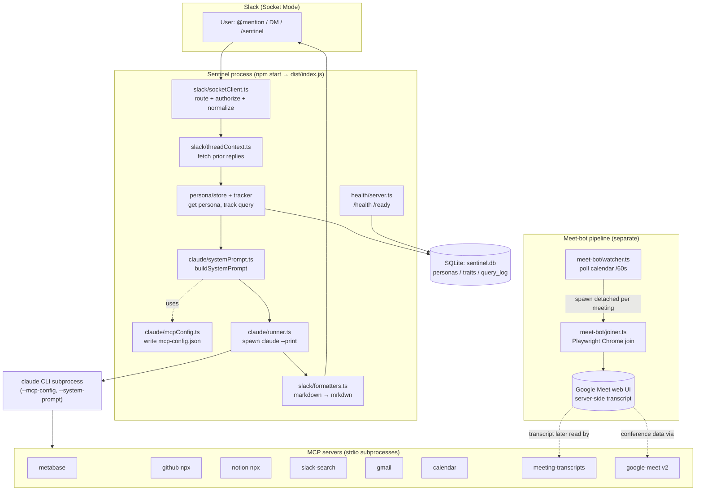

# Sentinel Architecture

## Overview

Sentinel is a leadership/data assistant for Newton School, delivered as a Slack bot powered by the Claude CLI. It started as a narrow POC wired to three data sources (Metabase, GitHub, Notion), but the live codebase has grown well beyond that: it now spawns the `claude` binary as a subprocess with a dynamically generated `--mcp-config` that registers up to **eight MCP servers** — Metabase, GitHub (npx package), Notion (npx package), plus custom Slack-search, Gmail, Google Calendar, Drive/Docs transcripts, and Google Meet API v2 servers. On top of the Q&A bot, Sentinel runs an entirely separate **Playwright-driven Google Meet pipeline**: a calendar watcher polls the Sentinel Google account every 60s and auto-launches a headless Chrome bot that joins meetings and turns on Google's server-side transcription, so that meeting transcripts later become queryable. State (per-user personas, learned traits, and an audit log of every query) lives in a local SQLite database, and the process exposes `/health` and `/ready` HTTP endpoints for container orchestration.

## High-Level Component Diagram

The Q&A path (Slack → runner → Claude CLI → MCP servers) and the Meet-bot path (calendar watcher → joiner → Google's server-side transcript) are independent pipelines that happen to share the same process and the same Google OAuth credentials. They connect only loosely: the Meet bot ensures transcripts get *generated*, and the `meeting-transcripts` / `google-meet` MCP servers later let Claude *read* them.

## Runtime Entrypoints

Sentinel has two distinct ways to run:

1. **Main bot** — `npm start` (runs `node dist/index.js`; dev: `npm run dev` via tsx). `main()` in `src/index.ts` bootstraps in order: open SQLite (`getDb`), generate the MCP config (`getMcpConfigPath`), start the health server (`startHealthServer`), start the Meet watcher (`startMeetWatcher`), then create and start the Slack Socket Mode app. Every inbound message flows through `handleEvent`.
2. **Meet-bot scripts** — invoked separately from the main process:
   - `npm run meet-bot:setup` (`tsx src/meet-bot/setup.ts`) — one-time interactive headed Chromium launch so a human signs in as `sentinel@newtonschool.co`; the persistent profile (`data/sentinel-chrome-profile`) is reused by every later join.
   - `npm run meet-bot:join` (`tsx src/meet-bot/joiner.ts`) — the per-meeting joiner CLI (accepts a Meet URL, `--duration`, `--headed`, `--stay-mode`). Normally spawned automatically by the watcher, but can be run by hand.

## Subsystems

### entry-config — `src/index.ts`, `src/config.ts`, `src/logging/logger.ts`, `src/types/contracts.ts`
**Purpose:** Process bootstrap, env/config validation, structured logging, and shared type contracts. `config.ts` parses `process.env` with Zod at import time and calls `process.exit(1)` on invalid config. `logger.ts` is a Pino root logger with component child loggers. `index.ts` wires the whole pipeline and registers SIGINT/SIGTERM handlers (which only call `closeDb()`). `handleEvent` enforces a 3-request in-flight concurrency cap and drives the eyes→check/x reaction state machine.
**State:** Solid. Gaps: an empty `ALLOWED_USER_IDS` silently disables the bot for everyone (fail-closed but unwarned); shutdown does not drain in-flight requests or stop the Meet watcher.

### slack — `src/slack/socketClient.ts`, `src/slack/threadContext.ts`, `src/slack/formatters.ts`
**Purpose:** Inbound/outbound Slack transport over `@slack/bolt` Socket Mode. `socketClient.ts` routes three event types (`app_mention`, DM messages, `/sentinel` slash command), authorizes against `ALLOWED_USER_IDS`, strips the bot mention, and normalizes everything into a `SlackEventEnvelope` for a single injected `EventHandler`. `threadContext.ts` fetches up to 50 prior thread replies. `formatters.ts` converts Claude's Markdown to Slack mrkdwn while protecting code blocks.
**State:** Solid for formatters (well tested). Gaps: `socketClient.ts` and `threadContext.ts` have no tests; mentions/DMs get no immediate ack (only the slash command posts "Processing"); no event-retry de-duplication; thread context is truncated at 50 and errors are swallowed to `[]`.

### claude-runner — `src/claude/runner.ts`, `src/claude/systemPrompt.ts`, `src/claude/mcpConfig.ts`
**Purpose:** The bridge to the Claude CLI. `runner.ts` spawns `claude` in `--print` mode with `--dangerously-skip-permissions`, `--system-prompt`, and `--mcp-config`, applies a 120s timeout, and returns `{ text, durationMs }`. `systemPrompt.ts` builds the static "Sentinel" base prompt and appends IST time context, unavailable-source warnings, the user's persona, and learned traits with confidence ≥ 0.6. `mcpConfig.ts` regenerates `mcp-config.json` on **every** call (cache removed in commit 460bb4f) and reports unavailable sources; `SENTINEL_MCP_TMPDIR` isolates test writes.
**State:** Solid for systemPrompt/mcpConfig (well tested). Gaps & risks: `runner.ts` is untested; `--dangerously-skip-permissions` means read-only is only a soft prompt instruction; all MCP credentials are written in plaintext to `mcp-config.json` in a tmpdir; custom MCP servers run from `dist/mcp/*.js`, so `npm run build` is required before they work under `npm start`.

### mcp-data — `src/mcp/metabase.ts`, `src/mcp/slack.ts`, `src/mcp/gmail.ts`
**Purpose:** Custom stdio MCP servers giving the bot read access to backing data. **Metabase** (session auth) exposes `metabase_query` (native SQL), `metabase_get_question`, `metabase_list_dashboards`, `metabase_list_databases`. **Slack** (xoxp user token) exposes `slack_search_messages`, `slack_read_channel_history`, `slack_read_thread`. **Gmail** (OAuth2) exposes `gmail_search`, `gmail_read_thread`, `gmail_list_recent`.
**State:** Rough. No handler-level tests. Notable risks: `metabase_query` runs arbitrary native SQL with no read-only guard; the 401 re-auth path doesn't re-check `.ok`; Gmail body extraction misses nested multipart structures; no request timeouts or pagination anywhere; upstream error bodies are embedded into thrown errors.

### mcp-google — `src/mcp/calendar.ts`, `src/mcp/meet.ts`, `src/mcp/transcripts.ts`
**Purpose:** Stdio MCP servers for Google Workspace, all sharing one Sentinel-account OAuth2 refresh token. **calendar** (googleapis v3) — `calendar_list_events` (default Mon–Fri week), `calendar_get_event`, `calendar_search`. **google-meet** (raw fetch against Meet REST API v2) — `meet_list_conferences`, `meet_get_conference`, `meet_list_transcripts`, `meet_get_transcript_entries`, with an in-process token cache. **meeting-transcripts** (Drive v3 + Docs v1) — `transcript_search`, `transcript_read`, `transcript_list_recent`.
**State:** Rough. No handler-level tests. The product goal is only half-met by these servers: `transcripts.ts` returns nothing unless a Doc is shared with Sentinel, and `meet.ts` returns nothing unless Sentinel actually joined the call live (which is exactly what the Meet bot exists to enable — see `docs/MEET_TRANSCRIPT_EXPERIMENT.md`). No pagination; calendar week-math depends on local server time; Meet transcript "speakers" are raw participant resource names, not human names.

### persona-state — `src/state/db.ts`, `src/persona/store.ts`, `src/persona/tracker.ts`, `src/persona/types.ts`
**Purpose:** SQLite-backed per-user personalization. `db.ts` is a lazy `better-sqlite3` singleton (WAL + foreign keys) with idempotent migrations for `personas`, `persona_traits`, and `query_log` (the latter has `response_text`, `response_duration_ms`, `sources_used` columns added via guarded ALTERs). `store.ts` does get-or-create persona, list traits by confidence, and `upsertTrait` (asymptotic confidence growth toward a 0.95 ceiling). `tracker.ts` keyword-categorizes each query into one of seven `QueryCategory` buckets, logs it, and reinforces a `focus_area` trait.
**State:** Rough. Known functional bug: SQL returns snake_case columns but the `PersonaProfile`/`PersonaTrait` types declare camelCase, and rows are cast directly with no mapping — so `persona.displayName` / `trait.evidenceCount` read `undefined` in `systemPrompt.ts` ("speaking with **undefined**"). Traits only grow (no decay); `query_log` has no retention.

### meet-bot — `src/meet-bot/watcher.ts`, `joiner.ts`, `eventFilter.ts`, `modeDispatch.ts`, `meetUrl.ts`, `setup.ts`
**Purpose:** The Playwright Google Meet auto-join pipeline. `watcher.ts` polls the primary calendar every 60s, filters eligible events (`eventFilter.ts` + `meetUrl.ts` — starting within 2 min or in progress, valid Meet URL, not already joined), and spawns a **detached** joiner subprocess per meeting, logging stdout/stderr to per-spawn files under `data/meet-bot-logs`. `joiner.ts` launches the persistent Chromium profile, mutes mic/cam, clicks Join/Ask-to-join, starts transcription, then leaves or stays based on `modeDispatch.ts` (`leave-after-join` / `stay-until-end` / `hybrid`). `setup.ts` is the one-time sign-in script.
**State:** Rough. Pure helpers (`meetUrl`, `eventFilter`, `modeDispatch`) are well tested; `watcher.ts`, `joiner.ts`, `setup.ts` are not. Note: although `modeDispatch.ts` documents `leave-after-join` as the default, **`watcher.ts` hardcodes `--stay-mode stay-until-end`** (reverted in commit e53eb54/#17), so production behavior is stay-until-end. Risks: `--no-sandbox` + fake-media UI; full `process.env` (including all secrets) passed to the detached joiner; in-memory join dedup is lost on restart; concurrent joiners corrupt the shared Chrome profile.

### health-deploy — `src/health/server.ts`, `Dockerfile`, `docker-compose.yml`, `buildspec.yml`, `scripts/google-auth.js`, `scripts/test-oauth.js`
**Purpose:** Operational health and deployment. `server.ts` exposes `/health` (liveness, 200/503) and `/ready` (readiness gated on Slack + a SQLite `SELECT 1`), aggregating uptime, Slack/DB status, active MCP servers, and unavailable sources. The Dockerfile, compose file, and CodeBuild spec define the build/deploy pipeline. The OAuth helper scripts mint and validate `GOOGLE_REFRESH_TOKEN`.
**State:** Solid for the health server (well tested). Gaps: liveness and readiness semantics are conflated (a transient SQLite/Slack blip flips `/health` to 503); the container runs as root and installs no Chrome/Xvfb, so the Meet bot cannot actually run inside the documented image; no SIGTERM graceful shutdown; no `/metrics` endpoint (despite a `data/metrics` dir existing on disk).

### tests — `tests/*.test.ts`
**Purpose:** The vitest suite (45 files, 526 tests; `vitest.config.ts` present). Well covered: `formatters`, `buildSystemPrompt`, `mcpConfig` generation/availability, the Zod env schema (via a re-declared copy — does **not** import `src/config.ts`), DB migrations + `query_log`, `trackQuery` + `categorizeQuery`, the health server, and the Meet-bot helpers (URL parsing, event filter, mode dispatch, joiner env/args, watcher spawn/concurrency).
**State:** Rough relative to the project's strict-TDD mandate. Untested: `runner.ts`, `socketClient.ts`, `threadContext.ts`, `persona/store.ts` (only mocked), all six custom MCP servers, `joiner.ts` (browser path), `watcher.ts` (live poll loop), `setup.ts`, `index.ts`, and the real config loader. No integration/e2e tests.

## Data & State

- **`sentinel.db`** — SQLite (WAL mode, foreign keys), path from `SQLITE_DB_PATH` (default `./sentinel.db`, process-CWD relative). Opened lazily as a single `better-sqlite3` connection.
  - **`personas`** — one row per Slack user (`user_id` PK, `display_name`, `role`, timestamps). Created on first message; never updated afterward.
  - **`persona_traits`** — learned traits with `confidence` (grows toward 0.95) and `evidence_count`, `UNIQUE(user_id, label, value)`. The `focus_area` trait is reinforced per query.
  - **`query_log`** — append-only audit log of every interaction, including `response_text`, `response_duration_ms`, and `sources_used` (JSON, written but never read back). No pruning/retention.
- **`data/` directory** (runtime artifacts, gitignored):
  - `sentinel-chrome-profile/` — persistent signed-in Chromium profile shared by all Meet-bot joins.
  - `meet-bot-logs/` — one stdout/stderr log file per spawned joiner; no rotation/cleanup.
  - `metrics/` — present on disk; not surfaced by any health/metrics endpoint in the current code.
- **`mcp-config.json`** — regenerated on every Claude run in a tmpdir (overridable via `SENTINEL_MCP_TMPDIR`). Contains live credentials in plaintext.

## Deployment

- **Docker** — two-stage `node:20-alpine` image (`Dockerfile`): installs `@anthropic-ai/claude-code` + `curl`, builds and ships `dist/`, declares a `/app/data` volume, `EXPOSE 8080`, and a curl `HEALTHCHECK` against `/health`. The image does **not** install Google Chrome or Xvfb, so the Meet bot cannot run inside it as built.
- **docker-compose** — single `sentinel` service for local/single-host runs: `env_file: .env`, maps `HEALTH_CHECK_PORT`→8080, named volume `sentinel-data` at `/app/data`, overrides `SQLITE_DB_PATH`.
- **CI/CD — AWS CodeBuild** (`buildspec.yml`): `npm ci` → `tsc --noEmit` → `npm test` → ECR login → `docker build`/`push` (tagged with commit SHA and `latest`) → emit `imageDetail.json` and package `k8s/**` as deploy artifacts. Caches `node_modules`.
- **Target — Kubernetes + ECR.** Note: the `k8s/` directory referenced by `buildspec.yml` does not currently exist in the repo, and there is no explicit deploy stage consuming `imageDetail.json`.

## Known Gaps / Divergence from Original Docs

The older docs (`README.md`, `PLAN.md`, `CLAUDE.md`, `SENTINEL_PRD_V1.md`) describe an earlier, smaller system. Where they diverge from the live code:

- **Data sources understated.** README/PLAN/CLAUDE.md describe only Metabase + GitHub + Notion. The code registers up to eight MCP servers (those three plus Slack-search, Gmail, Google Calendar, meeting-transcripts, and google-meet). GitHub/Notion are now external npx packages (`@modelcontextprotocol/server-github`, `@notionhq/notion-mcp-server` — *not* `@modelcontextprotocol/server-notion`), and the `src/mcp/github.ts` / `src/mcp/notion.ts` files shown in the README tree do not exist.
- **Meet bot undocumented in the main docs.** The single largest feature — the Playwright calendar watcher + auto-join bot — is described only in `docs/MEET_TRANSCRIPT_EXPERIMENT.md`, and that doc predates the `leave-after-join`/`hybrid` stay-modes and the now-implemented calendar watcher.
- **Health server exists but was "deferred."** `PLAN.md` lists the health-check endpoint as deferred-to-v2, yet `/health` and `/ready` are implemented and used by the Docker HEALTHCHECK.
- **Audit log not documented.** `query_log`'s `response_text` / `response_duration_ms` / `sources_used` columns and `trackQuery` are not mentioned in README/PLAN.
- **Jira is aspirational only.** Listed as a confirmed v1 source in the PRD and referenced in keyword maps, but no Jira MCP server or connector exists anywhere in `src/`.
- **Stay-mode contradiction.** `modeDispatch.ts` documents `leave-after-join` as default, but the watcher hardcodes `stay-until-end`, so the memory-saving default is overridden in the production path.
- **Container can't run the Meet bot.** The Dockerfile lacks Chrome/Xvfb that `joiner.ts`/`setup.ts` require (`channel: 'chrome'` + a display).
- **Config tests test a copy.** `tests/config.test.ts` re-declares the Zod schema instead of importing `src/config.ts`, and the copy has already drifted (missing `HEALTH_CHECK_PORT`), so config-schema tests give false confidence.
- **TDD coverage gap.** Despite the strict-TDD mandate in `CLAUDE.md`, the runner, Slack socket client, all six custom MCP servers, the Meet joiner browser path, the live watcher poll loop, `setup.ts`, the persona store, and `index.ts` ship with no direct tests (the pure helpers around them are well covered).
- **Persona camelCase bug.** Persona/trait rows are read with snake_case column names but typed as camelCase, so personalized prompt fields silently resolve to `undefined`.
